# SKILL: Generating System Architecture Diagrams with Mermaid

## 1. Overview

This skill document captures the complete end-to-end process of creating a professional **Sequence Diagram** and **Activity Diagram** for the `Local AI Image Generator` project — from tool selection rationale and Mermaid syntax deep dives, to pitfall resolution and exporting high-resolution image files.

---

## 2. Tools & Technologies

| Tool / Technology | Purpose | Version / Source |
|---|---|---|
| **Mermaid.js** | Diagram syntax definition & SVG rendering | v10 (CDN via jsDelivr) |
| **HTML + Vanilla JS** | Host page & one-click export functionality | — |
| **Canvas API** | 2x high-resolution PNG rendering | Browser native |
| **XMLSerializer** | Lossless SVG export | Browser native |
| **Blob + URL.createObjectURL** | Dynamic download link generation | Browser native |

---

## 3. Diagram Selection Rationale

### Why Sequence Diagram?
When a system involves **cross-component, cross-thread asynchronous communication**, the Sequence Diagram is the most precise expressive tool:
- This project's flow — `MainWindow (UI Thread)` → `GenerationWorker (QThread)` → `AIEngine` → `Diffusers GPU Pipeline` — is a textbook lifecycle delegation pattern.
- A Sequence Diagram clearly illustrates "who calls whom at what point in time", "who waits for whom to respond", and conditional branches using `opt` and `rect` blocks.

### Why Activity Diagram?
When the goal is to document the **internal decision-making flow of a single function or module**, an Activity Diagram (implemented as `flowchart TD`) is the most intuitive choice:
- `AIEngine.generate()` internally contains complex branching logic: Chinese detection → translation validation → model switch check → safety filter toggle → two-stage decoupled generation.
- An Activity Diagram makes every decision node (`{}`) and process node (`[]`) immediately clear, with color-coded styling to instantly highlight high-risk operations such as VRAM garbage collection and VAE precision casting.

---

## 4. Mermaid Syntax Deep Dive

### 4.1 Sequence Diagram — Key Syntax

```mermaid
sequenceDiagram
    autonumber                          %% Auto-number every message
    actor User as User                  %% actor = human icon; participant = rectangle box
    participant UI as MainWindow (PySide6 UI)

    User->>UI: Click 'Start Generation'  %% Solid arrow = active call
    UI-->>User: Return result            %% Dashed arrow = response / return

    rect rgb(24, 24, 36)                %% Color block to group a phase
        Note over Engine, GPU: Phase Title
    end

    opt Condition Label                 %% Optional conditional block
        Engine->>GPU: Conditional call
    end
```


**Sequence Diagram Pitfalls:**
- `actor` vs `participant`: The former renders a human-shaped icon; the latter renders a rectangle. Choose based on semantics — use `actor` for humans, `participant` for system components.
- Inside `rect rgb()`, percentage-based colors (e.g. `50%`) are not supported. Use absolute `rgb()` integer values only.
- The scope of `Note over A, B` spans from column A to column B. Both Participants must already be declared before the `Note` line.

---

### 4.2 Activity Diagram (`flowchart TD`) — Key Syntax
```mermaid
flowchart TD
    Start(["Terminal Node"])            %% Rounded rectangle = Start/End node
    Process["Process Box"]             %% Rectangle = Processing step
    Decision{"Decision Diamond?"}      %% Diamond = Conditional branch

    Start --> Process --> Decision
    Decision -- "Yes" --> NextStep
    Decision -- "No"  --> AltStep

    subgraph GroupName ["Display Title"]   %% Subgraph to cluster related steps
        StepA --> StepB
    end

    style NodeId fill:#2e7d32,stroke:#1b5e20,color:#fff  %% Per-node color override
```

**Activity Diagram Pitfalls:**
- `subgraph` ID and display name must be written separately: `subgraph id ["Display Title"]`.
- In `style` declarations, short-form colors like `#fff` are generally valid, but some Mermaid versions require the full six-digit form `#ffffff` for the `color` property specifically.
- Arrow labels containing spaces must be wrapped in double quotes: `-- "Valid Result" -->`.

---

## 5. HTML Export Page Architecture

### 5.1 Why HTML Instead of Directly Generating an Image?

| Approach | Pros | Cons |
|---|---|---|
| **Mermaid CLI (Node.js)** | Directly outputs PNG/SVG | Requires Node.js + mermaid-cli installation (hundreds of MB) |
| **Python + Playwright** | Can automate batch conversion | Requires Playwright and its Chromium browser core |
| **Single HTML Page + Browser API** ✅ | Zero install, open instantly, lossless SVG vectors | Requires a browser (available on every computer) |

→ The **single HTML page approach** is the lightest-weight, highest-quality solution under a zero-external-dependency constraint.

---

### 5.2 Client-Side PNG Export — Technical Breakdown
```javascript
function exportPNG(containerId, filename) {
    const svg = document.getElementById(containerId).querySelector('svg');

    // Step 1: Serialize the Mermaid-rendered SVG DOM node into a string
    const source = new XMLSerializer().serializeToString(svg);
    const blob = new Blob([source], { type: "image/svg+xml;charset=utf-8" });
    const url = URL.createObjectURL(blob);

    // Step 2: Create an Image element to trigger browser SVG parsing
    const img = new Image();
    img.onload = () => {
        const canvas = document.createElement("canvas");
        const bbox = svg.getBoundingClientRect();

        // Step 3: 2x supersampling — ensures PNG text remains crisp and sharp
        canvas.width = bbox.width * 2;
        canvas.height = bbox.height * 2;
        const ctx = canvas.getContext("2d");

        // Step 4: Fill a dark background (prevents transparency issues in some viewers)
        ctx.fillStyle = "#1A1A1A";
        ctx.fillRect(0, 0, canvas.width, canvas.height);

        ctx.scale(2, 2);
        ctx.drawImage(img, 0, 0);

        // Step 5: Trigger browser file download
        const a = document.createElement("a");
        a.href = canvas.toDataURL("image/png");
        a.download = filename;
        a.click();
    };
    img.src = url;
}
```

**Key Design Decisions:**
- **2x Canvas Scale**: Prevents PNG blurriness caused by screen pixel density (DPI) differences, ensuring sharpness on high-DPI 4K monitors.
- **Explicit Background Fill**: Canvas defaults to a transparent background. Without the `fillRect()`, the exported PNG may appear white or black in certain applications. Explicitly filling `#1A1A1A` guarantees visual consistency.
- **Blob → Image → Canvas Three-Stage Pipeline**: This is the highest cross-browser compatibility chain for SVG-to-PNG conversion, avoiding security restrictions that some browsers impose when calling `drawImage(svg)` directly.

---

## 6. Common Pitfalls & Resolutions

| Problem | Root Cause | Resolution |
|---|---|---|
| Downloaded image is blank when button is clicked | Mermaid asynchronous rendering not yet complete | Wait until Mermaid's `<svg>` tag is present in the DOM before accessing it |
| PNG export has transparent or solid black background | Canvas defaults to transparent; SVG has no background fill | Call `fillRect()` with a solid background color before `drawImage()` |
| Downloaded SVG has no colors when opened in browser | Missing `xmlns` attribute declaration on the SVG element | Force-set `xmlns="http://www.w3.org/2000/svg"` on the cloned SVG node before serializing |
| `rect rgb()` color blocks do not render | Browser Content Security Policy (CSP) or Mermaid version incompatibility | Upgrade to Mermaid v10 and set `securityLevel: 'loose'` in `mermaid.initialize()` |
| Nodes inside `subgraph` have disordered layout | External arrows connecting directly into internal subgraph nodes | Connect external arrows to the first node of the subgraph; do not bypass it to connect to intermediate internal nodes |

---

## 7. Mermaid Initialization Configuration

```javascript
import mermaid from 'https://cdn.jsdelivr.net/npm/mermaid@10/dist/mermaid.esm.min.mjs';

mermaid.initialize({
    startOnLoad: true,     // Automatically render all .mermaid blocks on page load
    theme: 'dark',         // Dark theme, consistent with the project's visual identity
    securityLevel: 'loose' // Enables advanced syntax such as rect rgb() color blocks
});
```

> [!NOTE]
> Setting `securityLevel: 'loose'` introduces no actual security risk in this context, because the Mermaid diagrams are static content you authored yourself, running locally — they are not sourced from external user input.

---

## 8. Reusable Template

The following is the minimal reusable HTML host template for Mermaid diagrams:

```html
<!DOCTYPE html>
<html lang="en">
<head>
    <meta charset="UTF-8">
    <title>Diagrams</title>
    <style>
        body { background-color: #121212; color: #E0E0E0; padding: 40px; font-family: sans-serif; }
        .mermaid { text-align: center; }
    </style>
</head>
<body>
    <div class="mermaid">
        <!-- Paste your Mermaid code here -->
        flowchart TD
            A["Start"] --> B["End"]
    </div>
    <script type="module">
        import mermaid from 'https://cdn.jsdelivr.net/npm/mermaid@10/dist/mermaid.esm.min.mjs';
        mermaid.initialize({ startOnLoad: true, theme: 'dark', securityLevel: 'loose' });
    </script>
</body>
</html>
```
